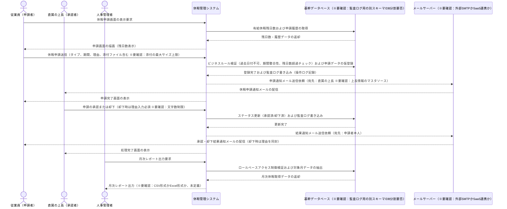

# 業務フロー

## 休暇申請・承認フロー

従業員からの休暇申請受付、直属上長による承認/却下、および人事管理者による月次レポート出力までの一連の業務プロセス。ビジネスルール、監査ログ、および通知フローを含みます。

**参加者:** 従業員（申請者） (actor)、直属の上長（承認者） (actor)、人事管理者 (actor)、休暇管理システム (system)、基幹データベース（※要確認：監査ログ用の別スキーマ/DB分割要否） (database)、メールサーバー（※要確認：外部SMTPかSaaS連携か） (external)

**メッセージフロー:**
- 従業員（申請者） → 休暇管理システム: 休暇申請画面の表示要求
- 休暇管理システム → 基幹データベース（※要確認：監査ログ用の別スキーマ/DB分割要否）: 有給休暇残日数および申請履歴の取得
  - 基幹データベース（※要確認：監査ログ用の別スキーマ/DB分割要否） ← 休暇管理システム: 残日数・履歴データの返却
  - 休暇管理システム ← 従業員（申請者）: 申請画面の描画（残日数表示）
- 従業員（申請者） → 休暇管理システム: 休暇申請送信（タイプ、期間、理由、添付ファイル含む ※要確認：添付の最大サイズ上限）
- 休暇管理システム → 基幹データベース（※要確認：監査ログ用の別スキーマ/DB分割要否）: ビジネスルール検証（過去日付不可、期間整合性、残日数超過チェック）および申請データの仮登録
  - 基幹データベース（※要確認：監査ログ用の別スキーマ/DB分割要否） ← 休暇管理システム: 登録完了および監査ログ書き込み（操作ログ記録）
- 休暇管理システム → メールサーバー（※要確認：外部SMTPかSaaS連携か）: 申請通知メール送信依頼（宛先：直属の上長 ※要確認：上長情報のマスタソース）
- メールサーバー（※要確認：外部SMTPかSaaS連携か） → 直属の上長（承認者）: 休暇申請通知メールの配信
  - 休暇管理システム ← 従業員（申請者）: 申請完了画面の表示
- 直属の上長（承認者） → 休暇管理システム: 申請の承認または却下（却下時は理由入力必須 ※要確認：文字数制限）
- 休暇管理システム → 基幹データベース（※要確認：監査ログ用の別スキーマ/DB分割要否）: ステータス更新（承認済/却下済）および監査ログ書き込み
  - 基幹データベース（※要確認：監査ログ用の別スキーマ/DB分割要否） ← 休暇管理システム: 更新完了
- 休暇管理システム → メールサーバー（※要確認：外部SMTPかSaaS連携か）: 結果通知メール送信依頼（宛先：申請者本人）
- メールサーバー（※要確認：外部SMTPかSaaS連携か） → 従業員（申請者）: 承認・却下結果通知メールの配信（却下時は理由を同封）
  - 休暇管理システム ← 直属の上長（承認者）: 処理完了画面の表示
- 人事管理者 → 休暇管理システム: 月次レポート出力要求
- 休暇管理システム → 基幹データベース（※要確認：監査ログ用の別スキーマ/DB分割要否）: ロールベースアクセス制御検証および対象月データの抽出
  - 基幹データベース（※要確認：監査ログ用の別スキーマ/DB分割要否） ← 休暇管理システム: 月次休暇取得データの返却
  - 休暇管理システム ← 人事管理者: 月次レポート出力（※要確認：CSV形式かExcel形式か、未定義）

